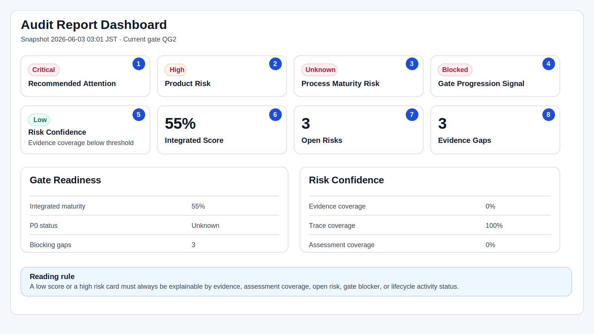
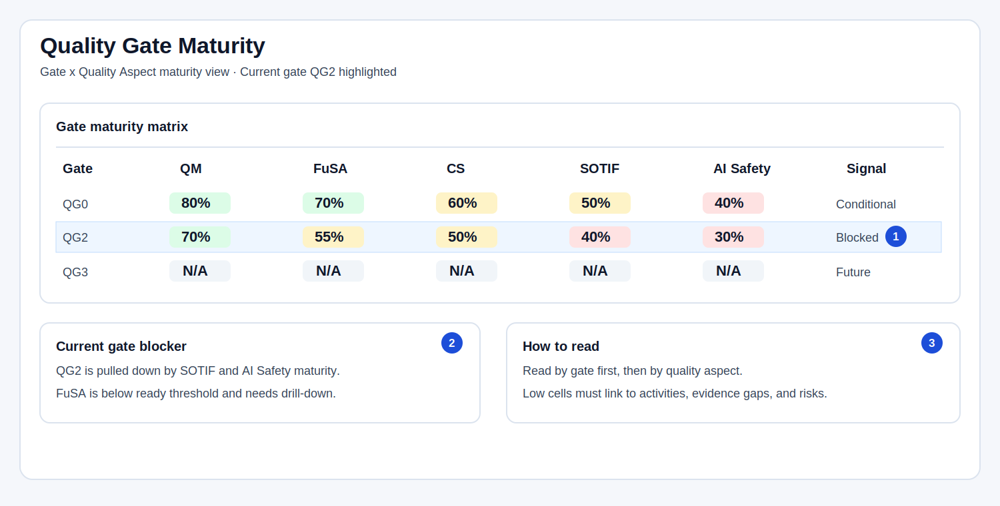
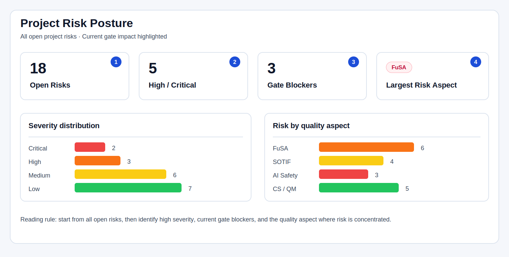
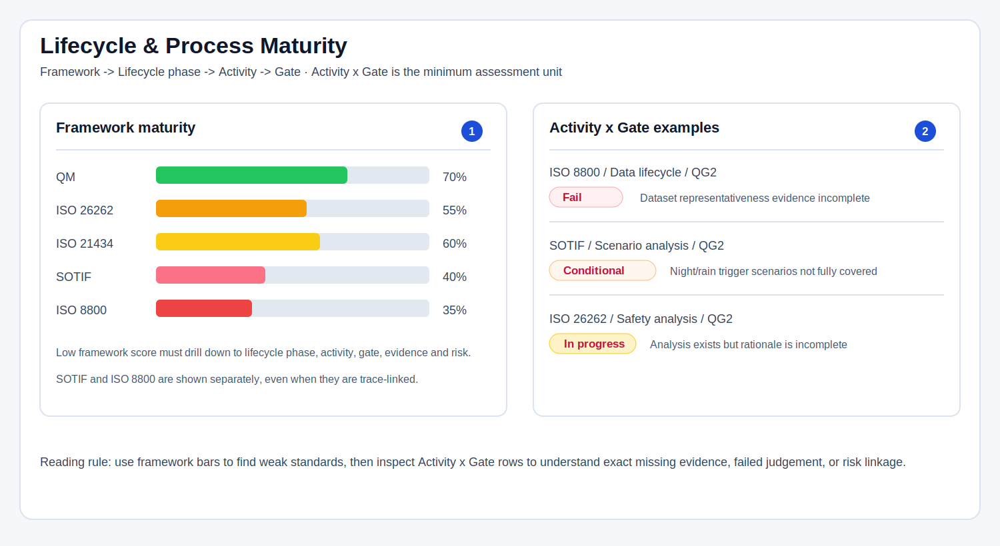

# 22 审核报告与生命周期成熟度设计

## 1. 文档目的

本文定义 PQRETS 质量 Dashboard 的判断框架、输入数据、核心参数和计算逻辑。

这个 Dashboard 的目标不是简单给产品打一个“质量好/不好”的分数，而是回答下面的问题：

```text
在当前项目范围、当前时间点、当前 Gate 下：
1. 产品质量风险是否可接受？
2. 当前 Gate 是否具备推进条件？
3. 支撑产品质量的生命周期活动和过程是否成熟？
4. 上述判断是否有足够证据支撑，可信度有多高？
```

因此，Dashboard 的核心定位是：

```text
基于证据的产品质量风险与成熟度判断框架
```

它展示风险、成熟度、证据和判断可信度；它不维护审批结论、管理层最终决定、残余风险接受签名或决策记录。

重要原则：

```text
没有发现问题 ≠ 产品质量好
没有证据 / 没有追踪 / 没有正式评估结果 = 质量状态未知，不能按通过处理
```

Dashboard 只展示一份正式报告结果。不存在第二套准备态报告，也不存在并列展示的准备态得分和正式得分。

参考输入：

- `input/qualityGateDefinition.drawio.png`：用于 QG0-QG5 Gate 进展，以及 QM/FuSA/CS 的 Gate 检查结构。
- `input/aspice_process_maturity.png`：用于过程成熟度视图的视觉参考。
- `image/AGENTS/1780380843105.png`：用于 ISO/PAS 8800 AI Safety 生命周期结构参考。
- ISO 26262：功能安全生命周期活动参考。
- ISO/SAE 21434：网络安全生命周期活动参考。
- ISO 21448：SOTIF 生命周期活动参考。
- ISO/PAS 8800：AI Safety 生命周期活动参考。

---

## 2. 质量判断框架

Dashboard 的质量判断由多个互相独立但相互影响的视角组成：

```text
产品质量判断
= Product Quality Risk
+ Gate Readiness
+ Quality Sub-Characteristic Maturity
+ Lifecycle Activity Maturity
+ Team Activity & Work Product Matrix
+ Risk Confidence
```

### 2.1 Product Quality Risk

Product Quality Risk 回答：

```text
产品本身现在有没有不可接受的质量风险？
```

它关注的是产品质量属性上的风险，例如：

- QM：一般质量问题、需求完整性、架构一致性、验证充分性。
- FuSA：安全目标、ASIL 分解、功能安全概念、技术安全概念、安全验证。
- CS：TARA、网络安全目标、网络安全需求、漏洞处置、安全验证。
- SOTIF：预期功能不足、触发条件、场景覆盖、感知/决策限制。
- AI Safety：数据生命周期、模型风险、训练/验证覆盖、运行时监控、人机交互风险。

Product Risk 不等于过程成熟度。一个项目过程看起来完整，但仍可能存在严重产品风险。

### 2.2 Gate Readiness

Gate Readiness 回答：

```text
当前 Gate 是否具备推进到下一阶段的质量条件？
```

它关注当前 Gate 的成熟度、阻塞项和推进信号，例如：

- 当前 Gate 的综合成熟度是否达到阈值。
- 是否存在 P0 Fail。
- 是否存在关键证据缺口。
- 是否存在当前 Gate 必须关闭的高风险问题。

Gate Readiness 给出的是 Dashboard 信号，不是最终审批决定。

### 2.3 Lifecycle Activity Maturity

Lifecycle Activity Maturity 回答：

```text
支撑产品质量判断的生命周期活动和过程是否成熟？
```

它关注 ISO 26262、ISO/SAE 21434、ISO 21448、ISO/PAS 8800 以及 QM 工程活动在当前 Gate 下是否达到期望成熟度。

这个视角类似 ASPICE 过程成熟度视图，但它不是正式 ASPICE capability level。它是 PQRETS 内部的生命周期成熟度判断，用来解释“为什么当前产品质量判断可信或不可信”。

### 2.4 Risk Confidence

Risk Confidence 回答：

```text
Dashboard 对风险和成熟度的判断有多可信？
```

它不代表风险大小，而代表判断可信度。

例如：

- Product Risk = Low，但 Evidence Coverage = 20%，不能说明产品质量好，只能说明当前证据不足。
- Process Maturity Risk = Unknown，说明缺少足够正式评估结果，不能推断过程成熟。
- Risk Confidence = Low 时，Dashboard 必须显示原因。

---

## 3. 报告视图

一次 Assessment Dashboard 应包含一个快照区和五个固定分析视图：

```text
0. Assessment Snapshot
1. Quality Gate Maturity
2. Project Risk Posture
3. Quality Sub-Characteristic Maturity
4. Lifecycle Activity Maturity
5. Team Activity & Work Product Matrix
```

其中 `Quality Gate Maturity`、`Quality Sub-Characteristic Maturity`、`Lifecycle Activity Maturity` 和 `Team Activity & Work Product Matrix` 不是四套独立评分体系，而是同一批正式评估结果的不同聚合视角：

```text
Activity x Gate Results
-> 按 Gate / Quality Aspect 聚合
   = Quality Gate Maturity

Activity x Gate Results
-> 按 Quality Sub-Characteristic / Quality Aspect 聚合
   = Quality Sub-Characteristic Maturity

Activity x Gate Results
-> 按 Framework / Lifecycle Phase / Activity 聚合
   = Lifecycle Activity Maturity

Activity x Gate Results
-> 按 Activity / Team / Work Product 聚合
   = Team Activity & Work Product Matrix
```

换句话说：

```text
Lifecycle Activity Maturity 看“生命周期活动是否成熟”
Quality Sub-Characteristic Maturity 看“这些活动是否把某个质量子特性真正落地”
Quality Gate Maturity 看“当前 Gate 下各质量方面是否达到推进条件”
Team Activity & Work Product Matrix 看“哪个团队负责哪些活动和工作产物，以及实际成熟度如何”
```

### 3.1 Assessment Snapshot

Assessment Snapshot 是管理层优先的总览区，用于快速判断当前项目评估状态是否需要关注。

推荐显示字段：

| 字段 | 回答的问题 |
| --- | --- |
| Recommended Attention | 当前项目需要多少管理层关注？ |
| Product Risk | 产品本身风险有多高？ |
| Process Maturity Risk | 生命周期/过程成熟度风险有多高？ |
| Gate Progression Signal | 当前 Gate 推进信号是什么？ |
| Risk Confidence | Dashboard 判断是否可信？ |
| Integrated Score | 当前 Gate 下的综合成熟度得分是多少？ |
| Open Risks | 当前仍开放的风险数量是多少？ |
| Evidence Gaps | 当前关键证据缺口数量是多少？ |

示例：

| 字段 | 示例值 | 解释 |
| --- | --- | --- |
| Project | ADAS L2 Camera Fusion ECU | 被审核产品或项目 |
| Current Gate | QG2 System Architecture Baseline | 当前质量门 |
| Recommended Attention | Critical | 需要管理层优先关注 |
| Product Risk | High | 存在可能影响 Gate 或发布的产品风险 |
| Process Maturity Risk | High | 生命周期活动成熟度不足，可能影响判断可靠性 |
| Gate Progression Signal | Blocked | 当前 Gate 不建议推进 |
| Risk Confidence | Low | 证据或评估覆盖不足，结论可信度低 |
| Integrated Score | 55% | 当前 Gate 综合成熟度百分比 |
| Open Risks | 3 | 未关闭风险数量 |
| Evidence Gaps | 3 | 缺失或不可用的关键证据数量 |

#### 3.1.1 Dashboard 示例图

下图是 Assessment Snapshot 的示例布局。它不是审批结论页面，而是风险信号、成熟度和判断可信度的集中展示。



图中 1-8 的关键数据解释如下：

| 编号 | Dashboard 字段 | 示例值 | 该值说明什么 | 主要计算或判断来源 |
| ---: | --- | --- | --- | --- |
| 1 | Recommended Attention | Critical | 当前项目需要管理层优先关注 | Product Risk、Process Maturity Risk、Gate Progression Signal、Risk Confidence 的综合信号 |
| 2 | Product Risk | High | 产品本身存在可能影响 Gate 或发布的质量风险 | 开放风险、严重度、质量属性风险分布、失败判定、关键证据缺口 |
| 3 | Process Maturity Risk | Unknown | 当前过程成熟度还不能可靠判断 | ISO 26262 / ISO 21434 / SOTIF / ISO 8800 / QM 活动缺少正式评估结果或证据 |
| 4 | Gate Progression Signal | Blocked | 当前 Gate 不建议推进 | P0 Fail、关键风险、关键证据缺口、Integrated Score 低于阈值 |
| 5 | Risk Confidence | Low | Dashboard 当前结论可信度低 | Evidence Coverage、Assessment Coverage、Trace Coverage、Assessment Freshness、Critical Unknown |
| 6 | Integrated Score | 55% | 当前 Gate 综合成熟度偏低 | 适用 Activity x Gate 正式成熟度结果的加权平均 |
| 7 | Open Risks | 3 | 当前仍有 3 个未关闭风险 | Risk Register 中状态为 open 的风险项 |
| 8 | Evidence Gaps | 3 | 当前有 3 个关键证据缺口 | 必需证据中缺失、不可用、过期或不可追踪的证据项 |

这个示例应按下面的顺序阅读：

```text
1. 先看 Recommended Attention，判断是否需要管理层关注。
2. 再分开看 Product Risk 和 Process Maturity Risk，避免把产品风险和过程风险混在一起。
3. 查看 Gate Progression Signal，理解当前 Gate 是否被阻塞。
4. 查看 Risk Confidence，判断前面这些结论是否可信。
5. 最后用 Integrated Score、Open Risks、Evidence Gaps 解释为什么出现这些信号。
```

例如：

```text
Integrated Score = 55%
```

表示当前 Gate 下的综合成熟度偏低。它不是“产品质量总分”，而是当前适用范围内正式成熟度结果的加权平均。如果多个适用活动没有正式评估结果，它们在计算中按 0 计入，因此得分会被拉低。

```text
Risk Confidence = Low
```

表示 Dashboard 对风险和成熟度的判断支撑不足。即使 Product Risk 没有显示 Critical，只要 Evidence Coverage 或 Assessment Coverage 不足，也不能把当前状态解释为“质量好”。

```text
Gate Progression Signal = Blocked
```

表示当前 Gate 存在阻塞信号。它不等于最终 No-Go 决策，但它要求 Dashboard 显示阻塞原因，例如 P0 Fail、关键证据缺口或关键生命周期活动未达到期望成熟度。

### 3.2 Quality Gate Maturity

Quality Gate Maturity 是以 Gate 为中心的视图。

它回答：

```text
当前项目在 QG0-QG5 各 Gate 上，按质量方面和质量属性看，成熟度如何？
```

典型展示方式：

```text
Gate -> Quality Aspect -> Quality Characteristic/Subcharacteristic
```

示例矩阵：

| Gate | QM | FuSA | CS | SOTIF | AI Safety |
| --- | ---: | ---: | ---: | ---: | ---: |
| QG0 | 80% | 70% | 60% | 50% | 40% |
| QG1 | 75% | 65% | 55% | 45% | 35% |
| QG2 | 70% | 55% | 50% | 40% | 30% |

该视图用于管理层和质量负责人查看：

- 哪个 Gate 最弱。
- 哪个质量方面拖累当前 Gate。
- 哪些质量属性成熟度不足。
- 当前 Gate 是否存在 P0 阻塞。

#### 3.2.1 Quality Gate Maturity 示例图



图中关键数据解释如下：

| 编号 | 数据 | 示例值 | 说明 |
| ---: | --- | --- | --- |
| 1 | QG2 行 | Blocked | 当前 Gate 是 QG2，整行高亮，用于管理层快速看到当前 Gate 的成熟度状态 |
| 2 | 当前 Gate blocker | SOTIF 40%、AI Safety 30% | 当前 Gate 被低成熟度质量方面拖累，需要 drill-down 到活动、证据和风险 |
| 3 | 阅读规则 | Gate -> Quality Aspect | 先按 Gate 判断阶段状态，再按质量方面定位弱项 |

这个视图的重点不是看某个单元格的分数本身，而是看：

```text
当前 Gate 哪些质量方面低于期望成熟度？
这些低分是否对应 P0 Fail、证据缺口或开放风险？
是否会影响 Gate Progression Signal？
```

例如 QG2 下：

```text
QM = 70%
FuSA = 55%
SOTIF = 40%
AI Safety = 30%
```

可以解释为：一般质量活动基本接近当前 Gate 要求，但 SOTIF 和 AI Safety 的生命周期活动明显不足，因此当前 Gate 不能只看 QM 得分就判断为 ready。

#### 3.2.2 Gate x Quality Aspect 单元格分数标准

Quality Gate Maturity 矩阵中的每个百分比，例如 `QM = 70%`，表示：

```text
在指定 Gate 下，某个 Quality Aspect 关联的适用 Activity x Gate 项，
基于正式评估结果计算出的成熟度百分比。
```

因此：

```text
QM = 70%
```

不是说“QM 产品质量等于 70 分”，而是说：

```text
在当前 Gate 下，QM 相关的适用活动、证据和交付物，
按正式评估结果加权计算后，达到 70% 成熟度。
```

基础计算规则：

```text
Quality Aspect Gate Score
= sum(Activity x Gate item_score * weight) / sum(weight)

item_score
= maturity_numeric / 4 * 100
```

其中成熟度状态转换如下：

| Maturity State | Numeric | Item Score |
| --- | ---: | ---: |
| Not assessed | 0 | 0 |
| Planned | 1 | 25 |
| In progress | 2 | 50 |
| Evidence available | 3 | 75 |
| Accepted | 4 | 100 |

单元格分数的默认判读标准：

| 分数区间 | 判读 | 含义 |
| ---: | --- | --- |
| 90-100 | Strong | 当前 Gate 下该质量方面成熟度强，关键活动和证据基本已被接受 |
| 70-89 | Ready range | 通常具备当前 Gate 所需成熟度，但仍需检查是否存在 P0 Fail 或关键风险 |
| 50-69 | Conditional | 部分活动或证据仍在进行中，可能需要条件性推进或补充证据 |
| 25-49 | Weak | 关键活动成熟度不足，通常会拉高 Process Maturity Risk |
| 0-24 | Not reliable | 正式评估结果或证据严重不足，不能支持当前 Gate 判断 |

默认 Ready 阈值建议为：

```text
Quality Aspect Gate Score >= 70%
Assessment Coverage >= 80%
Evidence Coverage >= 70%
No P0 Fail
No unresolved critical gate blocker
```

因此，即使 `QM = 70%`，也只能说明 QM 进入 ready range；如果 QM 下仍存在 P0 Fail、关键证据缺口或正式评估覆盖率不足，当前 Gate 仍不能解释为 Ready。

不同质量方面的含义如下：

| 单元格 | 示例值 | 表示什么 | 主要输入 |
| --- | ---: | --- | --- |
| QM | 70% | 通用质量管理、需求完整性、架构一致性、验证策略等活动在当前 Gate 的成熟度 | QM Activity x Gate、QM evidence、QM risks |
| FuSA | 55% | ISO 26262 相关功能安全活动在当前 Gate 的成熟度 | Item definition、HARA、Safety goal、FSC、TSC、安全分析和验证证据 |
| CS | 50% | ISO/SAE 21434 相关网络安全活动在当前 Gate 的成熟度 | TARA、Cybersecurity goals、CS requirements、漏洞分析和安全验证证据 |
| SOTIF | 40% | ISO 21448 相关 SOTIF 活动在当前 Gate 的成熟度 | 预期功能定义、触发条件、场景分析、已知/未知不安全场景验证证据 |
| AI Safety | 30% | ISO/PAS 8800 相关 AI Safety 活动在当前 Gate 的成熟度 | Data lifecycle、数据代表性、模型验证、鲁棒性、运行时监控和变更管理证据 |

示例解释：

```text
QG2 / QM = 70%
```

可以说明：QG2 下 QM 相关活动整体达到 ready range，通常意味着需求完整性、架构一致性或验证策略等通用质量活动已有较充分证据。

```text
QG2 / FuSA = 55%
```

可以说明：QG2 下 ISO 26262 活动仍处于 conditional 区间，可能是 HARA、安全需求分配、安全分析或安全验证证据尚不完整。

```text
QG2 / SOTIF = 40%
QG2 / AI Safety = 30%
```

可以说明：SOTIF 和 AI Safety 相关活动成熟度弱，尤其需要检查场景覆盖、触发条件、data lifecycle、数据代表性和模型验证证据。

### 3.3 Project Risk Posture

Project Risk Posture 是以当前项目风险为中心的视图。

它回答：

```text
在当前快照时间点，项目整体风险状态如何？
```

它应展示：

- 开放风险总数。
- 风险严重度分布。
- 按质量方面分布的风险。
- 按质量属性分布的风险。
- 当前 Gate 阻塞风险。
- 证据缺口导致的风险。

Project Risk Posture 的默认范围应是当前项目的全部开放风险，而不是某一个质量属性。

#### 3.3.1 Project Risk Posture 示例图



图中关键数据解释如下：

| 编号 | 数据 | 示例值 | 说明 |
| ---: | --- | --- | --- |
| 1 | Open Risks | 18 | 当前项目所有未关闭风险数量，不限于某一个质量属性 |
| 2 | High / Critical | 5 | 高严重度风险数量，是 Product Risk 升高的主要来源 |
| 3 | Gate Blockers | 3 | 直接影响当前 Gate 推进的风险或证据缺口 |
| 4 | Largest Risk Aspect | FuSA | 当前风险最集中的质量方面，用于确定管理关注重点 |

这个视图应按下面的顺序阅读：

```text
1. 先看开放风险总量，判断项目风险负载。
2. 再看 High / Critical 数量，判断是否存在不可接受风险。
3. 再看 Gate Blockers，判断这些风险是否影响当前 Gate。
4. 最后看风险集中在哪个 Quality Aspect，决定 drill-down 方向。
```

例如：

```text
Open Risks = 18
High / Critical = 5
Gate Blockers = 3
Largest Risk Aspect = FuSA
```

可以解释为：项目风险不是零散小问题，而是有 5 个高严重度风险，其中 3 个已经影响当前 Gate，且风险集中在 FuSA。因此 Product Risk 至少应进入 High 或 At Risk 级别。

### 3.4 Quality Sub-Characteristic Maturity

Quality Sub-Characteristic Maturity 是以 ISO/IEC 25010 质量子特性为中心的视图。

它回答：

```text
某个质量子特性，例如 Functional completeness，
在 QM、FuSA、CS、SOTIF、AI Safety 等适用质量方面中，
到底落地得怎么样？
```

这个视图非常重要，因为同一个质量子特性在不同质量方面中的含义不同。

例如 Functional completeness：

| 质量方面 | Functional completeness 要看什么 |
| --- | --- |
| QM | 产品功能是否覆盖项目需求和用户任务 |
| FuSA | 安全相关功能、安全机制、降级/故障处理是否完整 |
| CS | 网络安全相关功能、访问控制、日志、漏洞响应是否完整 |
| SOTIF | 预期功能、ODD、触发条件、场景覆盖是否完整 |
| AI Safety | 数据生命周期、模型能力边界、运行约束、监控功能是否完整 |

典型展示方式：

```text
Quality Characteristic/Subcharacteristic
-> Quality Aspect
-> Activity x Gate
```

示例表应优先表达“为什么相关”和“成熟度从哪里来”，而不是只堆分数：

| Characteristic | Quality Sub-Characteristic | 相关 Quality Aspects 与技术理由 | Aspect Realisation | Overall Maturity | Weakest Aspect / Main Weakness |
| --- | --- | --- | --- | ---: | --- |
| Functional suitability | Functional completeness | QM: 功能应覆盖项目需求和用户任务；FuSA: 安全相关功能、安全机制、降级功能必须完整；SOTIF: ODD、触发条件和场景覆盖决定预期功能是否完整；AI Safety: 数据生命周期、模型能力边界和运行约束必须覆盖 | QM 85% / FuSA 60% / SOTIF 55% / AI Safety 40% | 62% | AI Safety: data lifecycle 和模型能力边界证据不足 |
| Functional suitability | Functional correctness | QM: 输出应满足功能规格；FuSA: 感知、融合、控制输出错误可能导致安全风险；SOTIF: 正确性要覆盖已知触发场景和性能限制；AI Safety: 模型输出正确性、鲁棒性和误判边界需要证据 | QM 80% / FuSA 58% / SOTIF 52% / AI Safety 45% | 59% | AI Safety: corner case 与误判边界验证不足 |
| Performance efficiency | Time behaviour | QM: 响应时间影响用户可用性；FuSA: 告警、制动、转向相关延迟会影响安全目标；SOTIF: 延迟可能扩大触发场景风险；AI Safety: 推理延迟和降级策略影响运行安全 | QM 70% / FuSA 55% / SOTIF 50% / AI Safety 45% | 58% | AI Safety: inference latency 和降级证据不足 |
| Safety | Risk identification | FuSA: 需要识别 hazard 和 safety goal 相关风险；SOTIF: 需要识别预期功能不足、触发条件和场景风险；AI Safety: 需要识别数据、模型、运行监控和 misuse 风险 | FuSA 60% / SOTIF 50% / AI Safety 45% | 52% | SOTIF: trigger scenario 风险识别不完整 |
| Safety | Fail safe | FuSA: 故障时必须进入安全状态或受控降级；SOTIF: 非故障但功能限制场景也需要避免不安全行为 | FuSA 68% / SOTIF 48% | 56% | SOTIF: limitation scenario 下的 fail-safe 证据不足 |
| Safety | Hazard warning | FuSA: 安全相关危险状态需要可识别告警；SOTIF: ODD 边界、功能限制和误用风险需要告警或提示；QM: 告警信息需要可理解且与用户任务一致 | QM 76% / FuSA 62% / SOTIF 50% | 60% | SOTIF: ODD boundary warning 证据不足 |

这个表的行应按 `Characteristic -> Quality Sub-Characteristic` 排列，例如 `Safety` 下的 `Risk identification`、`Fail safe`、`Hazard warning` 放在一起。这样读者先看到质量模型结构，再看到每个子特性为什么会落到 QM、FuSA、CS、SOTIF 或 AI Safety。

这个视图应按下面的顺序阅读：

```text
1. 先看某个质量子特性的 Overall Maturity。
2. 再看它映射到哪些 Quality Aspect，以及为什么相关。
3. 再看它在各 Quality Aspect 下的落地成熟度。
4. 找出最低的 Quality Aspect。
5. Drill-down 到该 Quality Aspect 下的 Activity x Gate、Evidence、Risk 和 Trace Chain。
```

例如：

```text
Functional completeness = 62%
QM = 85%
FuSA = 60%
SOTIF = 55%
AI Safety = 40%
```

可以解释为：普通功能需求可能比较完整，但 AI Safety 和 SOTIF 方向的功能完整性不足，因此不能简单说 Functional completeness 已经成熟。需要继续检查 AI data lifecycle、场景覆盖、ODD 边界、触发条件和降级功能证据。

注意：Quality Sub-Characteristic Maturity 不是从质量子特性本身直接手动打分，而是从该质量子特性关联的 Activity x Gate、Evidence、Risk 和 Trace Chain 反向聚合出来。

表格必须显示 `Mapped Aspects & Rationale`，说明该质量子特性为什么与 QM、FuSA、CS、SOTIF 或 AI Safety 相关。该映射理由来自 ADAS quality aspect mapping，例如 `07_ADAS_Quality_Aspect_Mapping.json` 中的 `mappingReason`。项目 Scope 中选择了某个 aspect 只能说明“本项目要评估它”，不能作为“为什么相关”的技术理由；如果公共映射模型缺少对应 rationale，界面应明确显示为模型定义缺口，而不是显示成业务理由。

### 3.5 Lifecycle Activity Maturity

Lifecycle Activity Maturity 是以生命周期活动为中心的视图。

它回答：

```text
QM、FuSA、CS、SOTIF、AI Safety 的生命周期活动，在当前 Gate 下是否成熟？
```

典型展示方式：

```text
Framework -> Lifecycle Phase -> Activity -> Gate
```

该视图面向审核员和质量专家，用于解释：

- 哪个标准或活动族成熟度不足。
- 哪些生命周期活动导致 Process Maturity Risk 升高。
- 哪些活动缺少证据或正式评估结果。
- 哪些活动与产品风险或 Gate 阻塞相关。

#### 3.5.1 Lifecycle Activity Maturity 示例图



图中关键数据解释如下：

| 编号 | 数据 | 示例值 | 说明 |
| ---: | --- | --- | --- |
| 1 | Framework maturity | ISO 8800 = 35%、SOTIF = 40% | 标准或活动族层面的成熟度，用于定位过程弱项 |
| 2 | Activity x Gate examples | Data lifecycle / QG2 = Fail | 最小评估单元，解释为什么框架成熟度低 |

这个视图应按下面的顺序阅读：

```text
1. 先看哪个 Framework 成熟度低。
2. 再看该 Framework 下哪个 Lifecycle Phase 低。
3. 再定位到具体 Activity x Gate。
4. 最后查看 judgement、证据缺口、关联风险和 Trace Chain。
```

例如：

```text
ISO 8800 = 35%
SOTIF = 40%
ISO 26262 = 55%
```

可以解释为：AI Safety 和 SOTIF 的生命周期活动不成熟，尤其是 ISO 8800 的 data lifecycle 相关活动缺少足够正式评估结果或证据，因此 Process Maturity Risk 会升高。

注意：SOTIF 和 ISO 8800 可以建立追踪关系，但必须分开展示和分别计算成熟度。

### 3.6 Team Activity & Work Product Matrix

Team Activity & Work Product Matrix 是以开发团队为横轴、标准/生命周期活动为纵轴的责任和成熟度矩阵。

它回答两个问题：

```text
1. 每个团队当前负责或参与哪些 QM / FuSA / CS / SOTIF / AI Safety activities？
2. 每个 activity 对应团队的工作产物、证据、review 和风险状态如何？
```

这个视角不是替代 Lifecycle Activity Maturity，而是它的团队分解视图：

```text
Lifecycle Activity Maturity
-> Framework / Phase / Activity / Gate

Team Activity & Work Product Matrix
-> Activity / Team / Work Product / Evidence / Risk
```

#### 3.6.1 默认 ADAS 团队列

项目团队必须可配置。下面是 ADAS 产品评估的默认团队列，项目可以裁切、重命名或新增团队。

| Team Column | Team / Scope | Safety Classification |
| --- | --- | --- |
| PdM/PgM/PjM AD/ADAS | 产品、项目群、项目管理 | 跨团队 AD/ADAS 协调 |
| 360 deg Perception AD/ADAS Safety | 360 度感知功能团队 | AD/ADAS Safety |
| Map (Vehicle) CA & AD/ADAS Non-Safety | 车端地图功能团队 | CA 与 AD/ADAS Non-Safety |
| LaneLevelLocalization AD/ADAS Non-Safety | 车道级定位团队 | AD/ADAS Non-Safety |
| MotionPlanner AD/ADAS Safety-Rule | 基于规则的运动规划团队 | AD/ADAS Safety |
| MotionPlanner AD/ADAS Safety-ML (SWC: DDTP) | 基于 ML 的运动规划团队 | AD/ADAS Safety-ML |
| InterCommBev (Application Framework) | 应用框架与通信团队 | Application Framework |
| Controller AD/ADAS Safety | 控制器功能团队 | AD/ADAS Safety |
| Product Integrity | 产品完整性 / 独立质量完整性角色 | 跨团队 review / acceptance 支持 |
| Product Delivery (Optional) | 产品交付协调 | Optional |

#### 3.6.2 矩阵结构

矩阵的纵轴应是已批准的活动族 activity，而不是 gate checklist 的检查句子，也不是团队。

```text
Rows:
- Framework: QM / FuSA / CS / SOTIF / AI Safety
- Activity
- Gate
- Required Work Products

Columns:
- Team columns

Cell:
- Role
- Maturity
- Work product status
- Evidence status
- Blocking risk count
```

Role 建议使用：

| Role | Meaning |
| --- | --- |
| A | Accountable，主责团队 |
| C | Contributing，参与团队 |
| R | Reviewer / Approver，review 或接受角色 |
| N/A | Not applicable，不适用 |

矩阵单元格不应留空：适用团队显示 `A / C / R + 成熟度 + 工作产物状态 + 证据状态`；不适用团队明确显示 `N/A`。

主矩阵的视觉结构必须优先体现“纵轴 activity、横轴 team”。因此主表列顺序应为：

```text
Framework / Activity
-> Team columns
-> Assessment Detail
```

`Gate`、`Quality Context`、`Responsible Role`、`Expected Maturity`、`Work Product`、`Evidence`、`Judgement` 等信息应放在左侧 activity 单元格或右侧详情列中，不应插在 activity 与 team columns 之间，否则矩阵会变成普通明细表。

示例：

| Framework / Activity | PdM/PgM/PjM AD/ADAS | 360 deg Perception AD/ADAS Safety | Map (Vehicle) CA & AD/ADAS Non-Safety | LaneLevelLocalization AD/ADAS Non-Safety | MotionPlanner AD/ADAS Safety-Rule | MotionPlanner AD/ADAS Safety-ML (SWC: DDTP) | InterCommBev (Application Framework) | Controller AD/ADAS Safety | Product Integrity | Product Delivery (Optional) | Assessment Detail |
| --- | --- | --- | --- | --- | --- | --- | --- | --- | --- | --- |
| FuSA: HARA | C / 60% | C / 55% | N/A | C / 45% | A / 70% | C / 50% | N/A | C / 62% | R / 65% | N/A | QG1 / HARA report |
| FuSA: Safety verification and validation | C / 60% | C / 50% | N/A | C / 45% | C / 55% | C / 48% | N/A | A / 62% | R / 60% | N/A | QG2 / safety verification and validation report |
| SOTIF: Triggering condition identification | C / 55% | C / 50% | A / 40% | C / 45% | C / 48% | C / 45% | N/A | C / 52% | R / 58% | N/A | QG1 / triggering condition catalogue |
| SOTIF: Scenario analysis | C / 55% | C / 50% | A / 40% | C / 45% | A / 48% | C / 45% | N/A | C / 52% | R / 58% | N/A | QG1 / scenario catalogue and coverage rationale |
| AI Safety: Data lifecycle planning | C / 42% | C / 45% | C / 50% | A / 38% | C / 40% | N/A | N/A | C / 42% | R / 48% | N/A | QG2 / data lifecycle plan and governance model |
| CS: TARA | N/A | C / 55% | A / 68% | C / 52% | C / 55% | C / 50% | N/A | C / 55% | R / 62% | N/A | QG1 / TARA report |
| QM: Requirement review | A / 75% | A / 70% | A / 70% | A / 68% | A / 72% | A / 69% | A / 70% | A / 72% | R / 80% | C / 65% | QG1 / Functional suitability / requirement review |

单元格必须可以 drill-down：

```text
Activity: SOTIF Trigger scenario analysis
Team: MotionPlanner AD/ADAS Safety-Rule
Role: Accountable
Maturity: 48%
Required Work Products:
- Trigger scenario list: In progress
- ODD boundary analysis: Missing
- Scenario coverage report: Draft
Blocking Risks:
- R-SOTIF-002 High
Main Weakness:
- ODD boundary cases missing
```

#### 3.6.3 与 Risk Confidence 的关系

Team Activity & Work Product Matrix 不直接等于 Risk Confidence，也不应简单计算团队平均分。

它为 Risk Confidence 提供底层事实：

| Risk Confidence input | Team matrix source |
| --- | --- |
| Assessment coverage | required activities 是否有正式 Activity x Gate result |
| Evidence coverage | required work products 是否存在 evidence |
| Review freshness | work products 是否近期 review / accepted |
| Critical unknowns | required activity 没有 accountable team、没有 owner、没有 evidence 或存在 critical open risk |
| Trace coverage | activity / work product 是否能追踪到 Quality Sub-Characteristic、Evidence、Risk |

规则：

1. 每个 applicable activity 至少应有一个 `A = Accountable` team。
2. 一个 activity 可以有多个 `C = Contributing` team。
3. Product Integrity 可以作为 `R = Reviewer / Approver`，但不应替代 activity owner。
4. Product Delivery (Optional) 是 optional team，只有项目需要 delivery coordination 时才进入矩阵。
5. 多团队参与不能重复放大总分；overall maturity 应按 activity / work product 权重聚合，而不是按 team 数量重复计分。
6. 如果 activity 没有 accountable team，应计入 critical unknown 或 assessment coverage gap。
7. 如果 work product 缺失，应计入 evidence coverage gap。
8. 如果 work product 存在但未 review，成熟度最高不能达到 `4 Deliverable accepted`。
9. Excel gate checklist 中的 `Responsible Role` 不是具体开发团队分工。Team Matrix 应使用配置化的 activity-team responsibility model；系统可以提供默认 ADAS 分工模型，但项目专业团队必须能够裁切、覆盖或补充。
10. 不适用团队必须显示 `N/A`，不能留空。

---

## 4. 输入数据模型

Dashboard 的结论必须来自正式项目数据。

### 4.1 必要输入

| 输入 | 用途 |
| --- | --- |
| Project Scope | 确定哪些质量方面、质量属性、生命周期活动适用 |
| Current Gate | 确定当前阶段的期望成熟度和 Gate 判定标准 |
| Gate Definition | 定义 QG0-QG5 的质量门要求 |
| Lifecycle Activity Definition | 定义 QM、FuSA、CS、SOTIF、AI Safety 活动 |
| Activity x Gate Definition | 定义某活动在某 Gate 下的期望成熟度 |
| Formal Assessment Result | 记录正式成熟度和 Gate 判定 |
| Evidence | 支撑正式评估结果的证据 |
| Trace Chain | 连接质量属性、需求、风险、证据和活动 |
| Risk Register | 当前开放风险、严重度、状态和 Gate 影响 |

### 4.2 正式评估结果

Dashboard 只使用一类结果：

```text
Formal Assessment Result
```

正式评估结果表示当前报告采纳的评估结论。它可以来自人工录入、导入文件或系统计算，但进入 Dashboard 后统一作为正式结果展示。

正式评估结果应至少包含：

| 字段 | 含义 |
| --- | --- |
| scope item / activity item | 被评估对象 |
| gate | 所属 Gate |
| maturity_state | 成熟度状态 |
| judgement | Gate 判定 |
| primary_reason | 主要原因 |
| linked_evidence | 支撑证据 |
| linked_risks | 关联风险 |
| assessment_result_status | 正式结果状态 |
| assessment_result_owner | 结果负责人 |
| assessment_result_date | 结果日期 |

---

## 5. 核心参数定义

### 5.1 Integrated Score

Integrated Score 是当前 Gate 下的综合成熟度得分。

它回答：

```text
当前项目按适用范围、当前 Gate 要求、正式评估结果和证据状态综合看，成熟度是多少？
```

它不是“产品质量总分”，也不是发布批准结论。

建议公式：

```text
Integrated Score
= weighted average of applicable formal maturity results
```

如果某个适用项没有正式评估结果：

```text
该项 maturity = 0 Not assessed
```

这样做的原因是：没有评估结果不能被当作成熟，也不能从总分计算中排除，否则会把未知项误算成通过项。

### 5.2 Product Risk

Product Risk 是产品风险等级。

建议分档：

| Level | 含义 |
| --- | --- |
| Low | 当前没有明显产品风险，且关键证据基本可用 |
| Medium | 存在产品风险，但边界清楚、可跟踪、可控制 |
| High | 存在可能影响当前 Gate、后续交付或发布的产品风险 |
| Critical | 存在不可接受风险、P0 blocker 或关键安全/网络安全风险 |
| Unknown | 数据不足，无法判断产品风险 |

建议驱动因素：

- 高严重度开放风险数量。
- 当前 Gate 阻塞风险数量。
- 质量属性风险分布。
- 关键证据缺口。
- Failed judgement。
- Critical unknown item。

### 5.3 Process Maturity Risk

Process Maturity Risk 是生命周期/过程成熟度风险。

建议分档：

| Level | 含义 |
| --- | --- |
| Low | 生命周期活动对当前 Gate 来说足够成熟 |
| Medium | 存在过程缺口，但不会立即破坏当前质量判断 |
| High | 过程缺口可能导致风险判断不可靠 |
| Critical | 存在 P0 过程阻塞项或关键生命周期活动失败 |
| Unknown | 缺少足够正式评估结果，无法判断过程成熟度 |

Process Maturity Risk 主要由 Lifecycle Activity Maturity 视图驱动。

### 5.4 Risk Confidence

Risk Confidence 是风险判断可信度。

它回答：

```text
Dashboard 现在给出的风险和成熟度判断，有多少证据支撑？
```

建议使用四类覆盖率：

| 参数 | 含义 |
| --- | --- |
| Evidence Coverage | 所需证据中，有多少已存在且可用于判断 |
| Trace Coverage | 适用对象中，有多少能追踪到质量属性、风险、证据或活动 |
| Assessment Coverage | 适用对象中，有多少已有正式评估结果 |
| Assessment Freshness | 正式评估结果是否仍在有效期内 |

Risk Confidence 分档：

| Level | 含义 |
| --- | --- |
| High | 证据、追踪、正式评估覆盖率都较强，且无关键未知项 |
| Medium | 主要覆盖率达到最低要求，剩余未知项可控 |
| Low | 一个或多个关键覆盖率不足，或存在关键未知项 |
| Unknown | 数据不足，无法判断结论可信度 |

### 5.5 Evidence Coverage

Evidence Coverage 表示证据覆盖率。

公式：

```text
Evidence Coverage
= available required evidence / total required evidence
```

示例：

```text
当前 Gate 需要 20 份关键证据
其中 12 份已存在且可用于判断

Evidence Coverage = 12 / 20 = 60%
```

注意：

- 证据存在但内容不完整，不应算 fully available。
- 证据存在但不能追踪到评估对象，不能完全支撑成熟度。
- 证据过期或不适用于当前版本，应降低可用性。

### 5.6 Assessment Coverage

Assessment Coverage 表示正式评估覆盖率。

公式：

```text
Assessment Coverage
= items with formal assessment result / applicable items
```

示例：

```text
当前项目适用 50 个 Activity x Gate 项
其中 35 个已有正式评估结果

Assessment Coverage = 35 / 50 = 70%
```

如果 Assessment Coverage 很低，Integrated Score 可能仍然显示一个数字，但 Risk Confidence 必须降低，并显示原因。

### 5.7 Trace Coverage

Trace Coverage 表示追踪覆盖率。

公式：

```text
Trace Coverage
= traceable applicable items / applicable items
```

Traceable 的基本含义是：该项可以从质量属性或生命周期活动追踪到相关需求、风险、证据或评估结果。

### 5.8 Gate Progression Signal

Gate Progression Signal 表示当前 Gate 的推进信号。

建议分档：

| Signal | 含义 |
| --- | --- |
| Ready | 当前 Gate 看起来具备推进条件 |
| Conditional | 可以考虑推进，但仍存在条件性风险或覆盖率缺口 |
| Blocked | 当前 Gate 被 P0 Fail、关键风险或关键证据缺口阻塞 |
| Unknown | 数据不足，无法判断 Gate 推进状态 |

示例规则：

| 条件 | Signal |
| --- | --- |
| Integrated Score >= 70%，Assessment Coverage >= 80%，无 P0 Fail | Ready |
| Integrated Score 接近阈值，或存在可接受的条件性风险 | Conditional |
| 存在 P0 Fail、关键证据缺口、关键风险未关闭 | Blocked |
| 缺少必要正式评估结果 | Unknown |

### 5.9 Recommended Attention

Recommended Attention 是 Dashboard 总体关注等级。

它由 Product Risk、Process Maturity Risk、Gate Readiness 和 Risk Confidence 共同驱动。

| Level | 含义 |
| --- | --- |
| Normal | 当前没有明显风险信号，且判断可信 |
| Watch | 存在轻微风险或覆盖率不足，需要关注 |
| At Risk | 存在明确风险，可能影响当前 Gate 或后续交付 |
| Critical | 存在严重风险、P0 blocker 或 critical unknown |
| Escalation Needed | 风险、资源或责任问题超出项目团队控制范围 |

---

## 6. 生命周期框架库

Lifecycle Activity Maturity 应覆盖多个框架，并保持分开展示，不合并为一个标准。

### 6.1 QM 活动族

QM 活动覆盖通用工程质量管理和非安全专项的交付成熟度。

示例活动：

- Project quality planning
- Quality sub-characteristic tailoring
- Requirements completeness review
- Architecture consistency review
- Verification strategy and coverage planning
- Defect and issue management
- Release quality readiness

### 6.2 FuSA / ISO 26262 活动族

FuSA 活动覆盖功能安全生命周期。

示例活动：

- Item definition
- HARA
- Safety goal definition
- Functional safety concept
- Technical safety concept
- Safety requirements allocation
- Safety analysis
- Safety verification and validation
- Safety case / safety argument

### 6.3 CS / ISO/SAE 21434 活动族

CS 活动覆盖网络安全工程生命周期。

示例活动：

- Cybersecurity item definition
- TARA
- Cybersecurity goals
- Cybersecurity concept
- Cybersecurity requirements
- Vulnerability analysis
- Cybersecurity verification and validation
- Incident and vulnerability response planning

### 6.4 SOTIF / ISO 21448 活动族

SOTIF 必须作为独立活动族展示，不并入 FuSA 或 AI Safety。

示例活动：

- Intended functionality definition
- Hazard identification for intended functionality
- Triggering condition identification
- Scenario analysis
- Known unsafe scenario mitigation
- Unknown unsafe scenario exploration
- SOTIF verification and validation
- Field monitoring and feedback

### 6.5 AI Safety / ISO/PAS 8800 活动族

AI Safety 活动覆盖 AI 系统生命周期，必须包含 data lifecycle，并与 SOTIF 保持关联但不合并。

示例活动：

- AI system definition
- AI risk analysis
- Data lifecycle planning
- Data collection and sourcing
- Data annotation and labelling
- Dataset quality and representativeness assessment
- Training and model development
- Model verification and validation
- Robustness and edge case evaluation
- Runtime monitoring
- Human-machine interaction safety
- Change management and post-deployment monitoring

### 6.6 框架之间的关系

不同框架应分开展示，但允许建立追踪关系。

示例：

```text
AI Safety 数据代表性不足
-> 可能影响 SOTIF 场景覆盖
-> 可能影响 Product Risk
-> 可能阻塞当前 Gate
```

这类关系用于 drill-down 和原因解释，不用于把 SOTIF 和 AI Safety 合并成一个成熟度得分。

---

## 7. 最小评估单元：Activity x Gate

生命周期成熟度的最小评估单元是：

```text
Lifecycle Activity x Quality Gate
```

原因是同一个活动在不同 Gate 下的期望成熟度不同。

示例：

| Activity | QG1 期望 | QG2 期望 | QG3 期望 |
| --- | --- | --- | --- |
| TARA | 初版可用 | 与架构同步并评审 | 与实现和验证结果闭环 |
| Data lifecycle plan | 初版计划 | 数据集定义和质量准则明确 | 数据质量证据可用 |
| SOTIF scenario analysis | 初步场景识别 | 场景覆盖策略明确 | 验证结果可追踪 |

### 7.1 GateLifecycleCheckDefinition

`GateLifecycleCheckDefinition` 定义某个活动在某个 Gate 下应该达到什么状态。

| 字段 | 含义 |
| --- | --- |
| framework | QM / ISO 26262 / ISO 21434 / SOTIF / ISO 8800 |
| lifecycle_phase | 生命周期阶段 |
| activity | 活动名称 |
| gate | QG0-QG5 |
| expected_maturity | 该 Gate 下的期望成熟度 |
| required_evidence | 必需证据 |
| pass_criteria | Gate 判定标准 |
| weight | 对框架得分的相对权重 |
| related_quality_aspect | 关联质量方面 |
| related_quality_subcharacteristic | 关联质量子特性 |

### 7.2 ActivityGateResult

`ActivityGateResult` 保存正式评估结果。

| 字段 | 含义 |
| --- | --- |
| definition_id | 对应 GateLifecycleCheckDefinition |
| project_id | 项目 |
| maturity_state | 活动/证据/交付物成熟度 |
| judgement | Gate 判定：Pass / Fail / Waived / Not Assessed |
| primary_reason | 主要原因 |
| linked_evidence_ids | 关联证据 |
| linked_risk_ids | 关联风险 |
| assessment_result_status | 正式结果状态 |
| assessment_result_owner | 结果负责人 |
| assessment_result_date | 结果日期 |

---

## 8. 成熟度状态

### 8.1 推荐成熟度等级

成熟度不建议使用过高要求的 0-5 capability level。Dashboard 可采用更贴近交付物状态的 0-4 模型。

| 数值 | 状态 | 含义 |
| ---: | --- | --- |
| 0 | Not assessed | 未评估或无正式结果 |
| 1 | Planned | 已计划，但关键活动或证据尚未形成 |
| 2 | In progress | 活动已开始，部分证据可用 |
| 3 | Evidence available | 关键证据已存在，可以支撑初步判断 |
| 4 | Accepted | 证据、交付物或活动结果已被接受，可支撑当前 Gate |

### 8.2 Evidence available 与 Accepted 的区别

这两个状态必须区分清楚：

| 状态 | 判断重点 |
| --- | --- |
| Evidence available | 证据已经存在，可以被检查 |
| Accepted | 证据或交付物已经满足当前 Gate 的接受标准 |

示例：

```text
TARA 文档已经提交，并能追踪到网络安全目标。
=> Evidence available

TARA 已覆盖当前架构、威胁场景和风险处置，并满足 QG2 接受标准。
=> Accepted
```

这不是“谁 review 过”的区别，而是交付物是否满足当前 Gate 接受标准的区别。

### 8.3 Judgement

Judgement 回答：

```text
这个 Activity x Gate 项是否满足 Gate 判定标准？
```

| Judgement | 含义 |
| --- | --- |
| Pass | 满足 Gate 标准 |
| Conditional Pass | 可条件通过，仍需跟踪风险或补充证据 |
| Fail | 不满足 Gate 标准 |
| Waived | 经正式裁剪或豁免，不作为阻塞项 |
| Not Assessed | 尚无正式评估结果 |

Maturity State 和 Judgement 不完全相同：

```text
成熟度 = 活动/证据/交付物到了什么状态
判定 = 是否满足当前 Gate 标准
```

---

## 9. 计算逻辑

### 9.1 单项成熟度得分

每个 Activity x Gate 项转换为数值：

| Maturity State | Numeric |
| --- | ---: |
| Not assessed | 0 |
| Planned | 1 |
| In progress | 2 |
| Evidence available | 3 |
| Accepted | 4 |

归一化为百分比：

```text
item_score = maturity_numeric / 4 * 100
```

### 9.2 框架成熟度得分

框架得分按适用活动加权平均：

```text
framework_score
= sum(item_score * weight) / sum(weight)
```

如果适用项没有正式评估结果：

```text
item_score = 0
```

### 9.3 Integrated Score

Integrated Score 按各框架或各质量方面加权聚合。

示例：

| 框架 | 权重 | 得分 |
| --- | ---: | ---: |
| QM | 1.0 | 70% |
| ISO 26262 | 1.5 | 55% |
| ISO 21434 | 1.2 | 60% |
| SOTIF | 1.3 | 40% |
| ISO 8800 | 1.3 | 35% |

计算：

```text
Integrated Score
= (70*1.0 + 55*1.5 + 60*1.2 + 40*1.3 + 35*1.3)
  / (1.0 + 1.5 + 1.2 + 1.3 + 1.3)
= 52.8%
≈ 53%
```

### 9.4 P0 和阻塞项上限

如果存在 P0 Fail 或关键阻塞项，Dashboard 必须显示 blocking warning。

可选策略：

```text
如果存在 P0 Fail，则 Gate Progression Signal = Blocked
如果存在 P0 Fail，则 Integrated Score 可以显示原始分数，但不得解释为 Ready
```

也可以采用产品线策略对分数加上限：

| 条件 | 上限策略示例 |
| --- | --- |
| 存在 P0 Fail | Integrated Score cap at 49 |
| 关键证据缺失 | Gate Readiness cap at Conditional |
| Assessment Coverage 低于 50% | Risk Confidence = Low 或 Unknown |

### 9.5 Unknown 的处理

Unknown 不是 0 分的同义词。

```text
0 Not assessed = 该项计入得分时按 0 处理
Unknown = Dashboard 对该风险或成熟度等级无法可靠判断
```

示例：

```text
某个活动适用，但没有正式评估结果：
- Integrated Score 中该项按 0 计入
- Assessment Coverage 下降
- Risk Confidence 下降
- 对应框架可能显示 Unknown 或 High risk
```

---

## 10. 示例：为什么 Dashboard 会显示这些值

假设当前项目为 ADAS L2 Camera Fusion ECU，当前 Gate 为 QG2。

### 10.1 输入状态

| 输入 | 当前状态 |
| --- | --- |
| 适用 Activity x Gate 项 | 50 |
| 已有正式评估结果 | 30 |
| 必需证据 | 40 |
| 可用证据 | 24 |
| 可追踪项 | 45 |
| 开放风险 | 3 |
| P0 Fail | 1 |
| 关键证据缺口 | 3 |

### 10.2 覆盖率

```text
Assessment Coverage = 30 / 50 = 60%
Evidence Coverage = 24 / 40 = 60%
Trace Coverage = 45 / 50 = 90%
```

解释：

- Trace Coverage 高，说明链路基本建立。
- Evidence Coverage 和 Assessment Coverage 不足，说明结论支撑不够。
- 因此 Risk Confidence 不能是 High。

### 10.3 Integrated Score

假设各框架加权后得到：

```text
Integrated Score = 55%
```

解释：

- 55% 表示当前 Gate 综合成熟度偏低。
- 它不是产品质量总分。
- 它说明当前正式结果、证据和活动成熟度还不足以稳定支持 Gate 推进。

### 10.4 Process Maturity Risk = High

原因可能是：

```text
ISO 26262: Safety analysis 在 QG2 未达到 expected maturity
SOTIF: scenario analysis 证据不足
ISO 8800: data lifecycle 活动缺少正式评估结果
```

这说明过程或生命周期活动不足，可能导致产品风险判断不可靠。

### 10.5 Risk Confidence = Low

原因：

```text
Evidence Coverage = 60%，低于 70% 阈值
Assessment Coverage = 60%，低于 80% 阈值
存在 3 个关键证据缺口
```

所以即使某些风险看起来不高，也不能解释为产品质量已经充分受控。

### 10.6 Gate Progression Signal = Blocked

原因：

```text
存在 P0 Fail
存在关键证据缺口
Integrated Score 低于 Ready 阈值
```

结论：

```text
Dashboard 不做 Go / No-Go 决策。
它显示当前 Gate 推进信号为 Blocked，并显示阻塞原因。
```

---

## 11. Drill-down 要求

Dashboard 上任何低分、High risk、Unknown 或 Blocked 都必须能解释原因。

Drill-down 应至少显示：

| 内容 | 目的 |
| --- | --- |
| Framework | 哪个标准或活动族受影响 |
| Lifecycle Phase | 哪个生命周期阶段受影响 |
| Activity | 哪个活动不成熟 |
| Gate | 当前影响哪个 Gate |
| Expected Maturity | 当前 Gate 期望成熟度 |
| Actual Maturity | 正式结果中的实际成熟度 |
| Judgement | Gate 判定结果 |
| Primary Reason | 主要原因 |
| Linked Evidence | 支撑或缺失的证据 |
| Linked Risk | 关联风险 |
| Trace Chain | 与质量属性、需求、证据的追踪关系 |

示例：

| 字段 | 示例 |
| --- | --- |
| Framework | ISO 8800 |
| Phase | Data lifecycle |
| Activity | Dataset representativeness assessment |
| Gate | QG2 |
| Expected | Evidence available |
| Actual | In progress |
| Judgement | Fail |
| Primary reason | Dataset coverage evidence is incomplete for night/rain scenarios |
| Linked evidence | Dataset coverage report v0.2 |
| Linked risk | AI-SAF-003 |
| Linked quality attribute | AI Safety / Robustness |

---

## 12. 设计约束

1. Dashboard 是风险展示和成熟度解释工具，不是审批系统。
2. Dashboard 只展示一份正式报告结果。
3. Product Risk 和 Process Maturity Risk 必须分开展示。
4. Risk Confidence 必须独立展示，不能被 Integrated Score 替代。
5. Unknown 必须保留，不能用 0 或 Low 代替。
6. 缺少正式评估结果的适用项，计算得分时按 0 计入，同时降低 Assessment Coverage。
7. Evidence available 与 Accepted 必须区分。
8. SOTIF 必须作为独立生命周期活动族展示。
9. ISO 8800 必须包含 data lifecycle 活动。
10. AI Safety 和 SOTIF 可以关联追踪，但不能合并成熟度得分。
11. 每个低分、高风险、Unknown 和 Blocked 信号都必须显示原因。

---

## 13. 验收标准

1. Assessment Dashboard 包含 Assessment Snapshot、Quality Gate Maturity、Project Risk Posture、Quality Sub-Characteristic Maturity、Lifecycle Activity Maturity、Team Activity & Work Product Matrix。
2. 文档清楚说明 Dashboard 如何判断产品质量风险，而不是只列界面字段。
3. Integrated Score、Product Risk、Process Maturity Risk、Risk Confidence、Evidence Coverage、Assessment Coverage、Trace Coverage、Gate Progression Signal 均有定义。
4. 每个核心参数均说明输入、公式或判定规则。
5. Risk Confidence 为 Low 或 Unknown 时必须显示原因。
6. Gate Progression Signal 支持 Ready、Conditional、Blocked、Unknown。
7. Quality Gate Maturity、Quality Sub-Characteristic Maturity、Lifecycle Activity Maturity、Team Activity & Work Product Matrix 使用同一批 Activity x Gate 正式评估结果作为底层数据。
8. Quality Sub-Characteristic Maturity 按 Quality Sub-Characteristic -> Quality Aspect -> Activity x Gate 聚合，并显示 weakest aspect 和 main weakness。
9. Lifecycle Activity Maturity 使用 Activity x Gate 作为最小评估单元。
10. Team Activity & Work Product Matrix 显示可配置 ADAS 团队列、activity responsibility、work product status、evidence status 和 blocking risk context。
11. ISO 26262、ISO/SAE 21434、SOTIF、ISO 8800 和 QM 分开展示。
12. ISO 8800 活动中必须包含 data lifecycle。
13. SOTIF 必须独立展示，并可与 AI Safety 建立追踪关系。
14. 报告只展示一份基于正式评估结果的集成得分。
15. 低成熟度报告项可以 drill down 到证据、风险和 Trace Chain 上下文。
